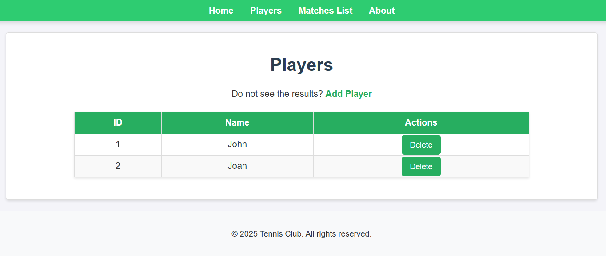
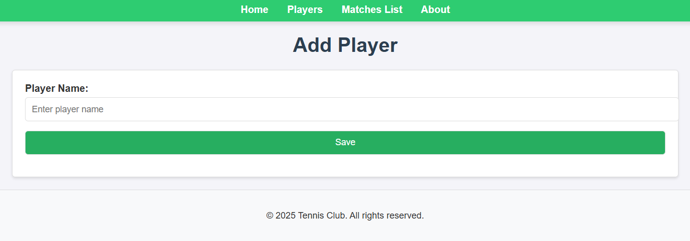
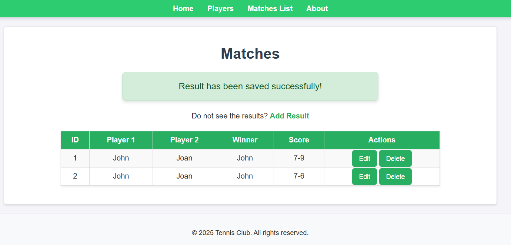
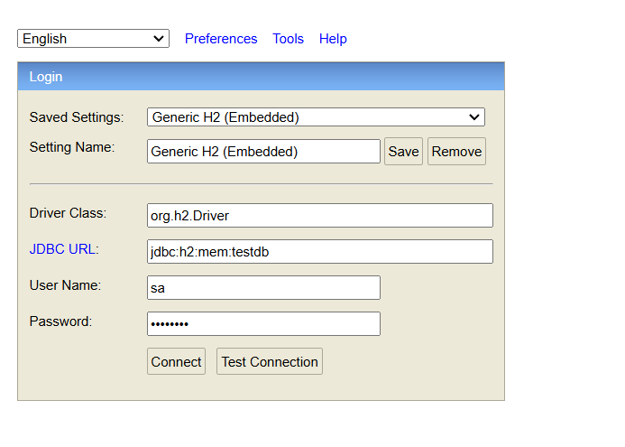
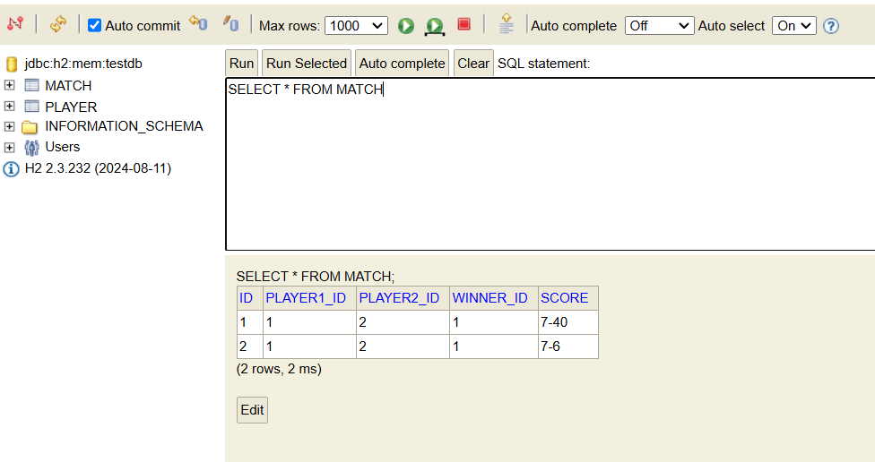
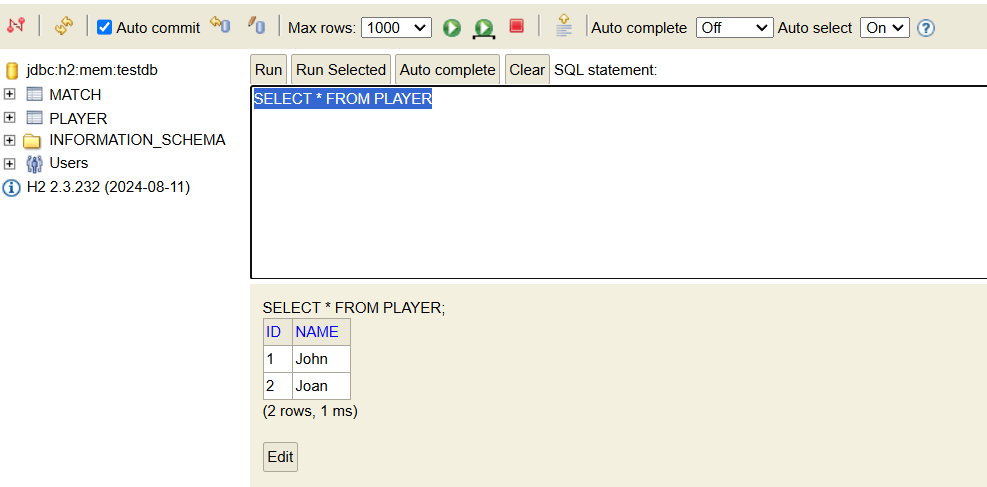

# Table of Contents
- [Overview](#overview)
- [Tech Stack](#tech-stack)
- [Running Application](#running-application)
- [Functions](#functions)
  - [Welcome Screen](#welcome-screen)
  - [Players Screen](#players-screen)
  - [Matches Screen](#matches-screen)
- [Endpoints](#endpoints)
  - [Player Endpoints](#players-endpoints)
  - [Matches Endpoints](#matches-endpoints)
  - [Example Requests/Responses](#example-requestsresponses)
- [Database Access](#database-access)

# Overview
This is just simple Tennis Club application for master studies project.
This application allow you to add new player then use added players to 
add tennis match result.

```info
Be aware that database is empty at the beginning and it's starts
as fresh for every new launch of application to manage this change 
properties parameter: spring.jpa.hibernate.ddl-auto=create-drop
```

# Tech Stack

* Java 17
* Spring Boot 3.4.1
* Thymeleaf + CSS
* H2 Database (database is automatically drop after stop the application)

# Running Application
    
    cd club
    ./mvnw spring-boot:run

# Functions
The application allow you to add new player and use added player to use this in matches results.

## Welcome Screen


## Players Screen





## Matches Screen



## 404 Error Screen


# Endpoints:

## Players Endpoints

# PlayerController

Base Path: `/players`

| HTTP Method | Endpoint               | Description                               |
|-------------|------------------------|-------------------------------------------|
| GET         | `/players/new`         | Display the form for adding a new player. |
| GET         | `/players/{id}/delete` | Delete a player.                          |

## Matches Endpoints

Base Path: `/matches`

| HTTP Method | Endpoint               | Description                              |
|-------------|------------------------|------------------------------------------|
| GET         | `/matches/new`         | Display the form for adding a new match. |
| GET         | `/matches/{id}`        | Edit an existing match.                  |
| POST        | `/matches/{id}`        | Update an existing match.                |
| GET         | `/matches/{id}/delete` | Delete a match.                          |

## Example Requests/Responses

* GET /players/{id}/delete
```html
GET http://localhost:8080/players/456/delete HTTP/1.1
```

```json
{
    "message": "Player deleted successfully",
    "playerId": 456
}
```

* GET /matches/{id}

```html
GET http://localhost:8080/matches/123 HTTP/1.1
```

```json
{
    "id": 123,
    "player1": "John Doe",
    "player2": "Jane Smith",
    "date": "2025-01-01",
    "score": "6-4, 7-5"
}
```

* POST /matches/{id}
```html
POST http://localhost:8080/matches/123 HTTP/1.1
Content-Type: application/json

{
    "player1": "John Doe",
    "player2": "Jane Smith",
    "date": "2025-01-01",
    "score": "6-4, 7-5"
}
```

```json
{
    "message": "Match updated successfully",
    "updatedMatch": {
        "id": 123,
        "player1": "John Doe",
        "player2": "Jane Smith",
        "date": "2025-01-01",
        "score": "6-4, 7-5"
    }
}
```

* GET /matches/{id}/delete
```html
GET http://localhost:8080/matches/123/delete HTTP/1.1
```

```json
{
    "message": "Match deleted successfully",
    "matchId": 123
}
```

# Database access:

http://localhost:8080/h2-console

Fill in the connection details on the H2 Console login page:

* JDBC URL: jdbc:h2:mem:tennisdb
  * tennisdb is the name of your in-memory database, as configured in your application.properties.

* Username: sa (default username for H2).
* Password: password



Executing queries:




