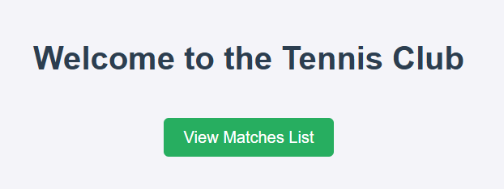
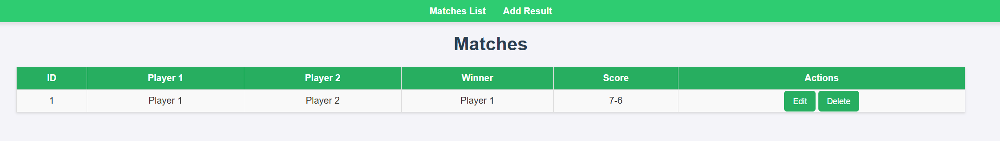
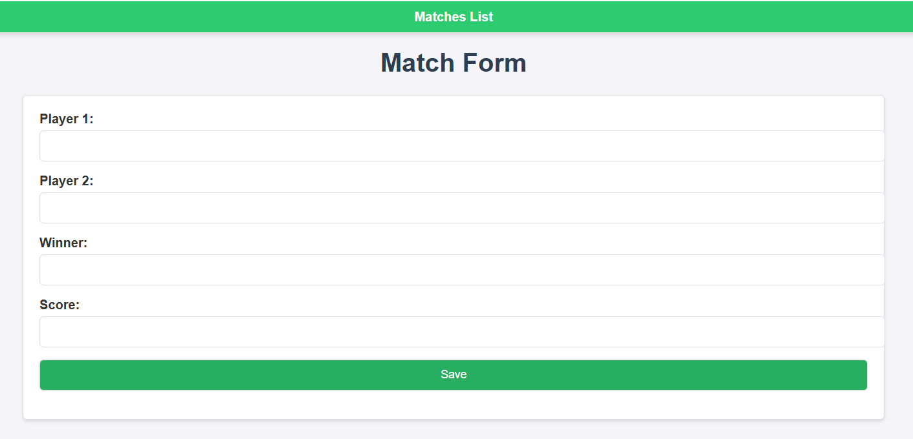
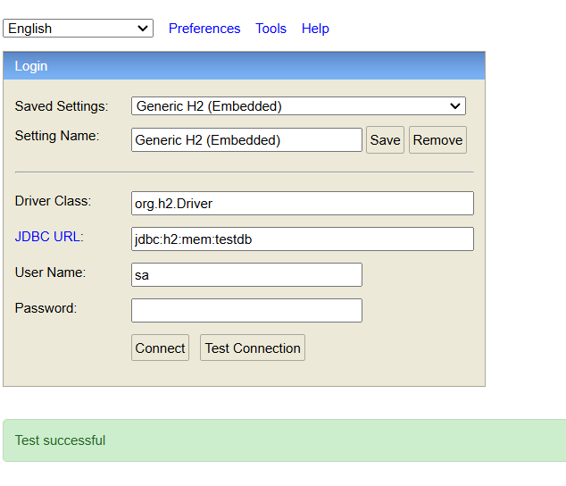
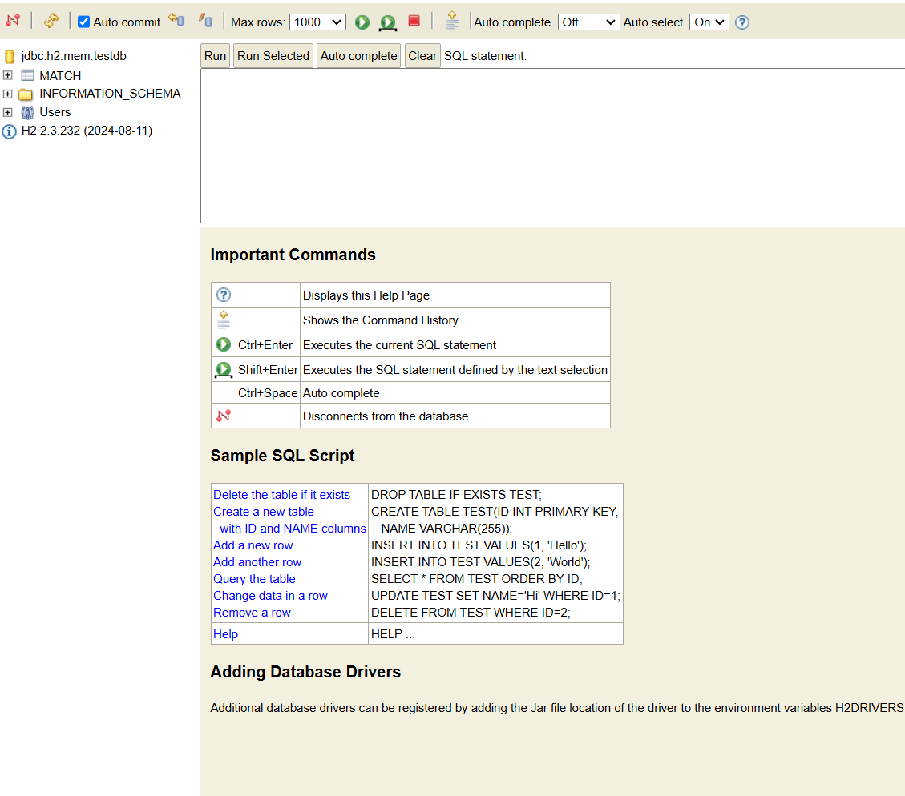

# Tech Stack

* Java 17
* Spring Boot 3.4.1
* Thymeleaf + CSS
* H2 Database (database is automatically drop after stop the application)

# Running Application
    
    cd club
    ./mvnw spring-boot:run

# Functions

**Welcome Screen**
 

**Matches Screen**


**Add Result/Edit Result Screen**


# Endpoints:
1. Get All Matches
   * Endpoint: `/matches`
   * Method: `GET`
   * Description: Retrieves a list of all tennis matches.    
   * Response
   
    ```json
    [
      {
        "id": 1,
        "player1": "Roger Federer",
        "player2": "Rafael Nadal",
        "winner": "Roger Federer",
        "score": "6-4, 6-3"
        },
        {
        "id": 2,
        "player1": "Novak Djokovic",
        "player2": "Andy Murray",
        "winner": "Novak Djokovic",
        "score": "7-6, 6-2"
      }
    ]
   ```

2. Add a New Match
   * Endpoint: `/matches`
   * Method: `POST`
   * Description: Adds a new match result.
   * Request Body (JSON):
   
   ```json
    {
      "player1": "Roger Federer",
      "player2": "Rafael Nadal",
      "winner": "Roger Federer",
      "score": "6-4, 6-3"
    }
   ```
    
   * Sample Response
    
   ```json
    {
      "id": 3,
      "player1": "Roger Federer",
      "player2": "Rafael Nadal",
      "winner": "Roger Federer",
      "score": "6-4, 6-3"
    }
   ```

3. Get Match Details
   * Endpoint: `/matches/{id}`
   * Method: `GET`
   * Description: Retrieves details of a specific match by its ID.
   * Path Parameter:
     * id (Long): Match ID, e.g., 1.
   * Sample Response:
   ```json
    {
      "id": 1,
      "player1": "Roger Federer",
      "player2": "Rafael Nadal",
      "winner": "Roger Federer",
      "score": "6-4, 6-3" 
    }
   ```

4. Update a Match
   * Endpoint: `/matches`
   * Method: `POST`
   * Description: Updates the details of an existing match.
   * Request Body (JSON):
    ```json
    {
      "id": 1,
      "player1": "Roger Federer",
      "player2": "Rafael Nadal",
      "winner": "Rafael Nadal",
      "score": "7-6, 6-4"
    }
    ```
   * Sample Response:
    ```json
    {
      "id": 1,
      "player1": "Roger Federer",
      "player2": "Rafael Nadal",
      "winner": "Rafael Nadal",
      "score": "7-6, 6-4"
    }
   ```

5. Delete a Match

* Endpoint: `/matches/{id}/delete`
* Method: `POST`
* Description: Deletes a match by its ID.
* Path Parameter:
    * id (Long): Match ID, e.g., 1.
* Sample Response:
    * `200 OK` if successful.

6. Endpoints notes

* The id field is auto-generated for new matches.
* All fields (`player1`, `player2`, `winner`, and `score`) are required when adding or updating a match.
* Make sure the application is running locally on port `8080` before testing.

# Database access:

http://localhost:8080/h2-console

Fill in the connection details on the H2 Console login page:

* JDBC URL: jdbc:h2:mem:tennisdb
  * tennisdb is the name of your in-memory database, as configured in your application.properties.

* Username: sa (default username for H2).
* Password: password




